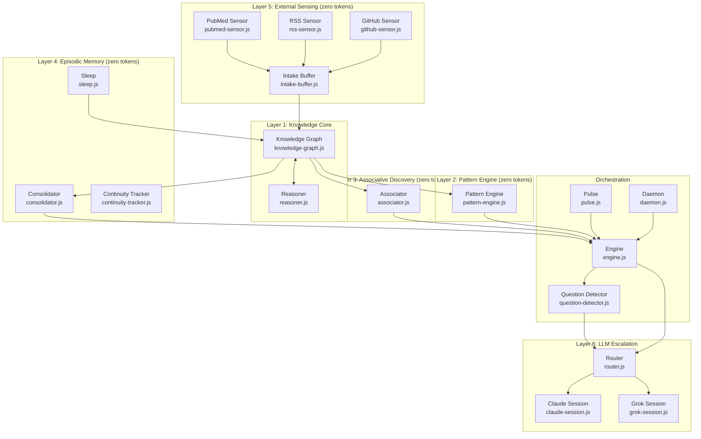

# Soma

**Autonomous background cognition for AI systems.**

Soma is a persistent reasoning engine that runs continuously alongside your AI assistant — building a knowledge graph, detecting patterns, forming episodic memories, and thinking independently between conversations.

It is the difference between an AI that *remembers* your last session and one that has been *thinking about your work* while you were away.

---

## What makes it different

Most "autonomous AI" systems are prompt chains. Soma is a cognitive architecture.

The critical design insight: **most cognition should cost nothing**. Layers 2–5 of Soma run entirely without API calls — no tokens, no cost, no latency. The knowledge graph grows, patterns are detected, episodes are consolidated, and emergent associations are discovered through pure graph computation.

LLMs are brought in only when local reasoning is genuinely insufficient. And even then, the router decides which tier of LLM the problem warrants — cheap and fast for lookup, capable for synthesis, deep for strategic reasoning.

This makes Soma practical to run continuously. It isn't burning tokens every cycle. It's building structure, and only escalating when structure isn't enough.

---

## Who is this for?

- **Developers building personal AI systems** who want background reasoning without designing a cognitive architecture from scratch
- **AI assistant developers** who want their system to persist knowledge and detect patterns between sessions
- **Researchers** interested in zero-token reasoning architectures as an alternative to pure RAG
- **Anyone frustrated** that their AI "forgets everything" — this is the infrastructure layer that fixes that

If you're looking for a plug-and-play memory widget, this isn't it. If you want to understand how a persistent reasoning layer works and adapt it to your system, this is for you.

---

## Architecture

Six layers, each building on the last. The first five can run without any LLM.



### Layer 1: Knowledge Core

**`src/layers/knowledge-graph.js`** — Persistent graph of facts, theories, questions, and relationships. Each node has a type (`hypothesis`, `insight`, `observation`, `question`, `goal`, `correction`), tags, and a maturity level (`seed → growing → developing → mature → actionable`). Edges carry labeled relationships.

**`src/layers/reasoner.js`** — Forward and backward chaining inference over the graph. Detects contradictions. Generates hypotheses from connected nodes. Scores confidence.

### Layer 2: Pattern Engine (zero tokens)

**`src/layers/pattern-engine.js`** — TF-IDF frequency analysis across the graph. Temporal correlation between nodes created around the same time. Anomaly detection (nodes that suddenly stop being connected to). Runs every graph cycle. No API calls.

### Layer 3: Associative Discovery (zero tokens)

**`src/layers/associator.js`** — Finds structural analogies across the graph. Predicts missing edges using neighborhood similarity. Discovers emergent concept clusters that nobody named. All pure graph traversal — no semantic embeddings, no LLM.

### Layer 4: Episodic Memory (zero tokens)

**`src/layers/consolidator.js`** — Converts session narratives into timestamped episode nodes. Builds temporal chains. Detects project dormancy (topics that went quiet). Powers "what happened while you were gone" briefings.

**`src/layers/sleep.js`** — Thread warmth tracking between sessions. Active reasoning threads gain warmth from fresh connections and recent attention; they fade if ignored. Warmth scores surface the most alive ideas at session start.

**`src/layers/continuity-tracker.js`** — Optional: measures whether topology change is accumulating around a specific node over time. Useful for tracking how work on a particular question deepens the graph around it.

**Example briefing (what Soma reports when you return):**
```
Soma — 4h 23m since last session

New since you left:
  • 3 new inferences from knowledge graph cycle
  • Pattern detected: "auth middleware" mentioned in 4 separate sessions this week
  • GitHub: 2 new issues on your repo (both labeled "question")
  • 1 reasoning thread warming up: "refactor vs rewrite decision" — connected to 6 nodes

Active questions Soma is tracking:
  • What's blocking the mobile auth flow? (no resolution in 3 sessions)
  • Is the pattern-engine overlap with the reasoner intentional?
```

### Layer 5: External Sensing (zero tokens)

All sensors buffer through `src/sensors/intake-buffer.js` before ingestion into the knowledge graph.

**`src/sensors/github-sensor.js`** — Monitors repos for community activity: issues, PRs, stars, forks. Uses GitHub REST API (unauthenticated — 60 req/hr). Configure repos in `soma.config.js`.

**`src/sensors/rss-sensor.js`** — Ingests RSS/Atom feeds. Regex-based XML parsing — no npm dependencies. Configure feeds in `soma.config.js`.

**`src/sensors/pubmed-sensor.js`** — Optional: monitors PubMed for new literature on configured medical/research topics. Uses NCBI E-utilities (free tier). Only useful if your projects have a research/literature monitoring need.

### Layer 6: LLM Escalation

**`src/core/router.js`** — Determines what deserves expensive reasoning. Routes queries through four cost tiers:

| Tier | When | Backend |
|------|------|---------|
| `free` | Local KG can answer | None — graph traversal |
| `tactical` | Fast lookup, simple synthesis | Grok (fast, cheap) |
| `operational` | Nuanced analysis, multi-step reasoning | Claude Sonnet |
| `strategic` | Deep synthesis, architectural thinking | Claude Opus |

**`src/tools/claude-session.js`** — Managed multi-turn Claude CLI session. Acquires session lock before spawning, releases on close. Cross-platform binary detection (Windows `.exe` and Unix).

**`src/tools/grok-session.js`** — Stateless HTTP calls to xAI Grok API. Same interface as ClaudeSession for easy substitution.

---

## Safety architecture

Autonomous action is gated. Soma will not run deep-think or take real-world action unless ALL conditions pass:

1. **No active user sessions** — session-lock.js tracks registered sessions
2. **30+ minutes since last session ended** — configurable cooldown buffer
3. **Memory usage below threshold** — checks `os.freemem()` vs total
4. **No concurrent LLM process running** — prevents resource contention
5. **Daily deep-think cap not exceeded** — prevents runaway cycles

**Fail-safe:** if any condition check throws an error, Soma assumes UNSAFE and skips the cycle. A misconfigured gate is an open gate; the fail-safe makes it a closed one.

The session-lock system has two layers:
- **User session registry**: multiple concurrent users allowed, tracked by session ID
- **Background lock**: mutually exclusive — only one autonomous process can hold the LLM at a time

This architecture means Soma never interrupts active work, never creates resource contention with a running user session, and degrades gracefully if any safety check fails.

---

## Getting started

**Dependencies:** Zero npm dependencies for core reasoning. Claude CLI is required for LLM escalation (get it at claude.ai/code). Grok API key optional — system works Claude-only. Node.js 18+ required.

**Requirements:** Node.js 18+, Claude CLI on PATH (or configured via `soma.config.js`)

```bash
# Clone
git clone https://github.com/bryanralston/soma.git
cd soma

# Configure
cp soma.config.example.js soma.config.js
# Edit soma.config.js — set your name, home dir, projects, sensors

# Create data directory
mkdir -p data

# Start the daemon (continuous background mode)
npm start

# Or run a single pulse (one cycle, then exit — good for cron/Task Scheduler)
npm run pulse

# Interactive REPL
npm run repl

# Status check
npm run status
```

### Configuration

All personal configuration lives in `soma.config.js` (gitignored). See `soma.config.example.js` for the full schema with comments.

Minimum viable config:

```js
module.exports = {
  userName: 'Your Name',
  home: __dirname,
  dataDir: __dirname + '/data',
  projectTags: ['myproject'],
  sensors: {
    github: { repos: [] },
    rss: { feeds: [] },
    pubmed: { topics: [], enabled: false }
  },
  llm: {
    claude: { bin: 'claude' },
    grok: { apiKey: null }
  }
};
```

### First boot

On first run, Soma detects the empty knowledge graph and runs `src/core/first-boot.js` — which seeds the graph with a few foundational nodes to give the reasoner something to work with. After that, the graph grows from sensors, session narratives, and deep-think cycles.

---

## Running modes

**Daemon** (`npm start`): Continuous process. Graph cycles every 5 minutes. Deep-think is event-driven — triggered when a user session ends and the safety gate opens. Writes a PID file for single-instance enforcement.

**Pulse** (`npm run pulse`): Run-once mode. Spins up, runs one full graph cycle, deep-thinks if warranted, exits. Designed for cron / Windows Task Scheduler. Zero RAM when not running.

**REPL** (`npm run repl`): Interactive. Query the knowledge graph, run reasoner, check sleep state, inspect patterns. Good for debugging and exploration.

---

## Design principles

1. **Zero-token layers first.** Most cognition should cost nothing. Layers 2–5 run with no API calls. LLM is a last resort, not a first instinct.

2. **Safety before autonomy.** All safety gates must open. One failure blocks autonomous action. The fail-safe assumption is UNSAFE.

3. **Escalate only when needed.** The router decides what deserves expensive reasoning. Don't use Opus when Grok will do.

4. **Persist everything.** The knowledge graph is the memory. It survives restarts. Each cycle deepens it.

5. **Be honest about limitations.** `src/core/self-model.js` documents what Soma cannot do — and is updated when it discovers new limitations.

6. **Narrative over data.** Soma writes first-person journal entries, not log lines. The journal is meant to be read by the AI that picks up next session, not just stored.

---

## Project status

This is a working system extracted from a personal AI architecture. It is not a polished library. Configuration is required. Some parts (especially `action-pipeline.js` and `history-analyzer.js`) assume familiarity with the codebase and will need adaptation to your specific setup.

What works out of the box:
- Knowledge graph with full reasoning
- Pattern detection and associative discovery
- Sleep/warmth tracking
- Session briefings
- GitHub and RSS sensors (configure repos/feeds)
- Claude CLI integration

What needs configuration:
- `soma.config.js` — all personal details
- PubMed sensor — only useful for medical/research projects
- Action pipeline — needs your project paths

Contributions, questions, and forks are welcome.

---

## Background

Soma is the "mind" layer of Cortex, a personal AI partner system. The name comes from the tripartite architecture: **Cortex** (identity — the AI's personality and values), **Axon** (communication — the web dashboard and chat interface), **Soma** (thinking — this repo).

The distinction matters. Most AI systems conflate identity, interface, and reasoning into one thing. Separating them means the reasoning layer can be extracted, run independently, and adapted — which is what this repo is.

The design was motivated by a specific observation: Claude knows what happened last session because it reads session files. But it hasn't been *thinking* about the work. Soma exists to fill that gap — to do the background reasoning, pattern detection, and synthesis that makes a returning AI feel like it was actually present, not just briefed.

The knowledge graph persists. The patterns accumulate. The questions don't disappear when the chat window closes.

---

## Contributing

The most useful contributions right now:
- **Sensor implementations** for new data sources (Discord, email, calendar)
- **Cross-platform testing** — the codebase runs on Windows; Linux/Mac testing welcome
- **Alternative LLM backends** — the tool interface in `src/tools/` is designed for substitution

Open an issue before large PRs. The architecture is intentional — changes to the layer boundaries need discussion.

---

## License

MIT
